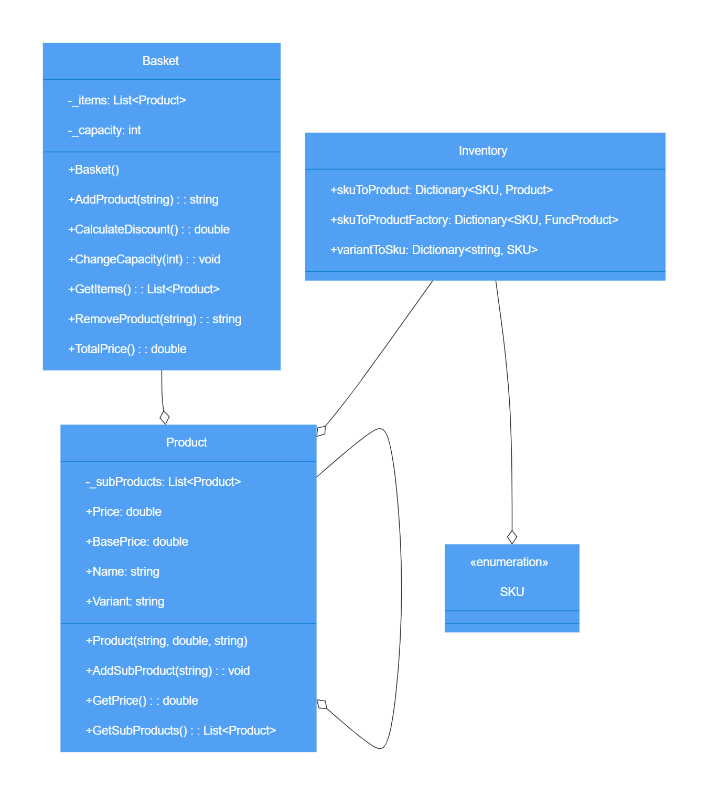

# Domain model and class diagram

## Basket Class

- **Method: AddProduct(product)**
  - **Action:** Add product to list.
  - **User Story:** As a member of the public, so I can order a bagel before work, I'd like to add a specific type of bagel to my basket.

- **Method: RemoveProduct(product)**
  - **Action:** Remove product from list.
  - **User Story:** As a member of the public, so I can change my order, I'd like to remove a bagel from my basket.

- **Method: AddProduct(product)**
  - **Output:** "You are overencumbered."
  - **User Story:** As a member of the public, so that I can not overfill my small bagel basket, I'd like to know when my basket is full when I try adding an item beyond my basket capacity.

- **Method: ChangeCapacity(n)**
  - **Action:** Set new capacity to `n`.
  - **User Story:** As a Bob's Bagels manager, so that I can expand my business, I’d like to change the capacity of baskets.

- **Method: RemoveProduct(product)**
  - **Output:** "No such product to remove."
  - **User Story:** As a member of the public, so that I can maintain my sanity, I'd like to know if I try to remove an item that doesn't exist in my basket.

## Product Class

- **Method: AddProduct()**
  - **Action:** Add products to other products.
  - **User Stories:**
    - As a member of the public, so I can order a bagel before work, I'd like to add a specific type of bagel to my basket.
    - As a customer, so I can shake things up a bit, I'd like to be able to choose fillings for my bagel.

- **Method: GetPrice()**
  - **Returns:** Price of product.
  - **User Story:** As a customer, so I know what the damage will be, I'd like to know the cost of a bagel before I add it to my basket.

## Inventory Class

- **Methods: Dictionaries**
  - **Use:** Utilize SKU enumeration.
  - **User Story:** As the manager, so we don't get any weird requests, I want customers to only be able to order things that we stock in our inventory.

## Additional Methods for Basket Class

- **Method: TotalPrice()**
  - **Returns:** The sum of the prices in the basket.
  - **User Stories:**
    - As a customer, so I know how much money I need, I'd like to know the total cost of items in my basket.
    - As a customer, so I don't overspend, I'd like to know the cost of each filling before I add it to my bagel order.

- **Method: CalculateDiscount()**
  - **Returns:** The applicable discounts.
  - **Promotions:**
    - All bagels 6 for 2.49.
    - All bagels 12 for 3.99.
    - Coffee + bagel for 1.25.
    - Note: Fillings not included.

